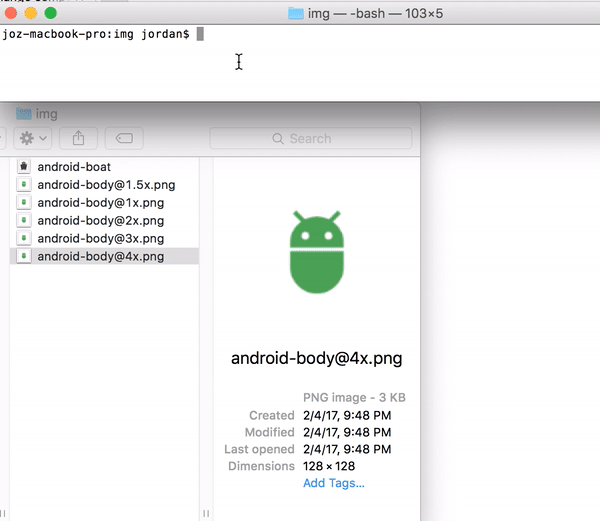

[travis-url]: http://travis-ci.org/#!/jordanjoz1/ios2androidres
[travis-build-image]: https://secure.travis-ci.org/jordanjoz1/ios2androidres.svg

[coveralls-url]: https://coveralls.io/r/jordanjoz1/ios2androidres
[coveralls-image]: https://coveralls.io/repos/jordanjoz1/ios2androidres/badge.svg

[pypi-url]: https://badge.fury.io/py/ios2andres
[pypi-image]: https://badge.fury.io/py/ios2andres.svg

[downloads-url]: https://pypi.python.org/pypi/ios2andres/
[downloads-image]: https://img.shields.io/pypi/dm/ios2andres.svg

[arsenal-url]: https://android-arsenal.com/details/1/5234
[arsenal-image]: https://img.shields.io/badge/Android%20Arsenal-ios2androidres-brightgreen.svg?style=flat

[codeclimate-url]: https://codeclimate.com/github/jordanjoz1/ios2androidres
[codeclimate-image]: https://codeclimate.com/github/jordanjoz1/ios2androidres/badges/gpa.svg

[![Travis build image][travis-build-image]][travis-url]
[![Coverage Status][coveralls-image]][coveralls-url]
[![PyPi version][pypi-image]][pypi-url]
[![PyPi download count image][downloads-image]][downloads-url]
[![Android Arsenal][arsenal-image]][arsenal-url]
[![Code Climate][codeclimate-image]][codeclimate-url]


ios2androidres
===========================
Ever find yourself stuck with image assets exported for iOS? Rather than write your own script, use this one to rename and move iOS image resources so they work for Android.




## Getting started

```bash
pip install ios2andres
```

## Usage

From the directory that contains the iOS image files simply run

```
ios2andres
```

By default, this creates output directories in the current folder. You can change this output directory to be your current project's directory.

```
ios2andres --output /Path/to/project/app/src/main/res/
```

### Options

#### -h, --help
Prints help message.

#### --input
Location of the iOS formatted files to be moved and renamed to Android formatted resources.

#### --output
Output directory path (directory will be created automatically). Like, `/Path/to/project/app/src/main/res/`

By default creates drawable directories in the current working directory.

#### --prefix
Prefix some text, like "ic_" to all files.


## Release History
* 2017-02-06   v0.1.8   First working pypi build
* 2017-02-05   v0.1.0   Initial release

## License

See the [LICENSE](LICENSE) file for license rights and limitations (MIT).
